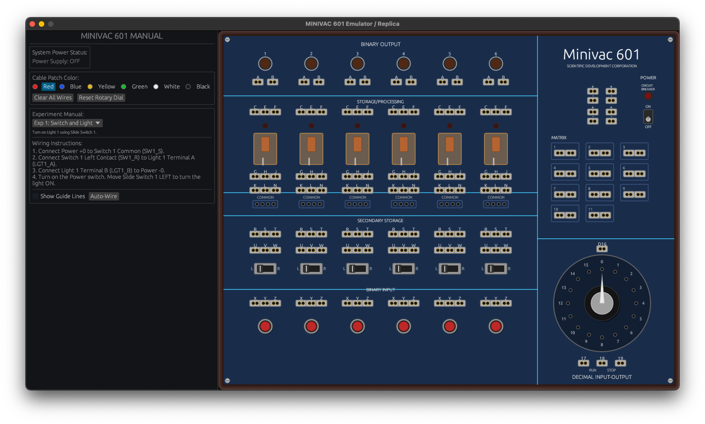

# oxide-601

A desktop emulator and replica of the **Minivac 601**, the 1961 electromechanical
digital computer trainer designed by Claude Shannon and sold by Scientific
Development Corporation. Built in Rust with [`egui`](https://github.com/emilk/egui)
and a DAW-style patch bay for wiring experiments with draggable cables.



## What it does

The emulator reproduces the panel of the original machine and simulates the
electrical behaviour of every component in real time:

- **6 relays** with mechanical pull-in latency, indicator lights, and
  normally-open / normally-closed contacts.
- **6 binary output lights** with brightness driven by the solved voltage drop.
- **6 push buttons** (momentary) and **6 slide switches** (toggle).
- **16-position rotary dial** with a motor that can be driven electrically or
  dragged by hand.
- **Power supply** with a circuit breaker that trips on a short.
- A **matrix** and **tie-point** blocks for distributing signals.

Components are wired together by dragging patch cables between port holes, just
like the original's spring-clip terminals.

## How the simulation works

The core lives in `src/simulation.rs` and is independent of the UI:

1. Every terminal is a logical `ComponentPort` mapped to a stable `Uuid`.
2. Each frame, `tick(dt)` collects all zero-resistance connections (user cables
   plus the internal contacts implied by switch, button, and relay state) and
   groups ports into electrical **nets** via a flood fill.
3. Nets touching a `+` terminal are pinned to 12 V and nets touching a `-`
   terminal to 0 V. Loads (lights, relay coils, the motor) bridge nets with a
   resistance, and the remaining net voltages are solved with Jacobi iteration.
4. Relays integrate a `relay_progress` value over `dt` to model pull-in and
   drop-out latency, so feedback wiring (a relay driving its own
   normally-closed contact) oscillates instead of deadlocking.

The UI in `src/app.rs` is immediate-mode: it draws the hardware with
`egui::Painter`, records the on-screen pixel position of every port during
layout, and renders the patch cables as cubic Bezier curves with a downward
"sag" to mimic gravity.

## Running

This is a standard Cargo project.

```bash
cargo run --release
```

Run the simulation unit tests with:

```bash
cargo test
```

## Controls

| Action            | How                                                     |
| ----------------- | ------------------------------------------------------- |
| Wire two ports    | Drag from one port hole to another                      |
| Unplug a cable    | Drag from an occupied hole                              |
| Toggle power      | Click the POWER switch on the panel                     |
| Reset the breaker | Click the breaker (or the sidebar button) after a short |
| Press a button    | Click and hold a push button                            |
| Flip a switch     | Click a slide switch                                    |
| Turn the dial     | Drag the dial knob (when the motor is not running)      |
| Pick cable colour | Choose a colour in the sidebar before wiring            |

## Guided experiments

The sidebar includes a built-in experiment manual. Pick an experiment to read
its wiring instructions, click **Show Guide Lines** to overlay the target
wiring, or click **Auto-Wire** to patch it automatically. Included experiments:

1. Switch and light.
2. Push button energising a relay.
3. Self-latching relay (memory).
4. Relay buzzer (oscillator).
5. Motorised dial clock generator.

## Project layout

```text
src/
  main.rs         Window setup and eframe entry point
  app.rs          egui UI: panel rendering, cable patching, experiment manual
  simulation.rs   Electrical solver and component state (no UI dependencies)
```

## License

No license has been specified yet.
